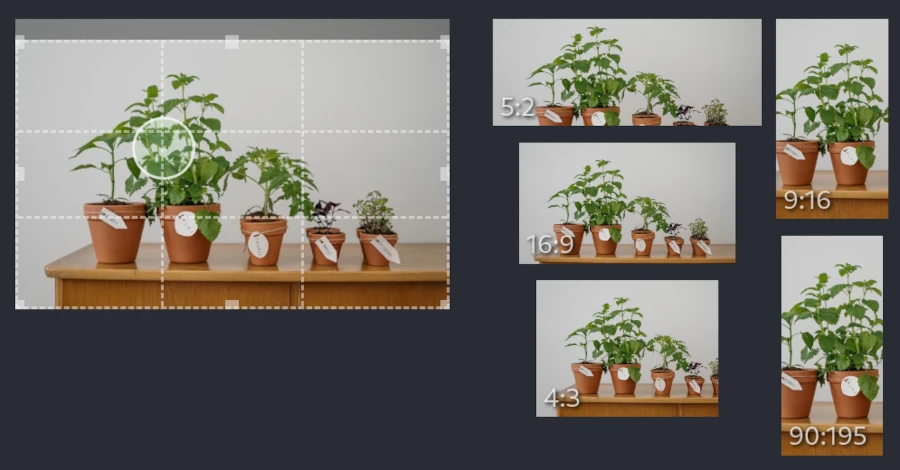

# focus-crop-react

Crop images to the desired aspect ratio around a focus point with React components.

## The Problem

Often you need to present images in different aspect ratios. For example,
on a wide screen (aka desktop) you use a 16:9 aspect ratio but on a narrow screen (aka mobile)
you show it in 4:3 or 9:16. Manually cropping is time consuming and not very
flexible if you discover later that another aspect ratio is needed.

If you mark the most important area of the image with a focus point you can automate
the process and create images cropped to arbitrary aspect ratios. Optionally,
you can cut parts from the border. In effect, this zooms the image and ensures that
unwanted parts are never shown.

[Demo:](https://www.atombrenner.de/focus-crop-react/index.html)

1. Mark the most important part of the image by clicking inside the image.
   You can drag the focus point to a different position with a live
   preview of the generated croppings.
   The focus point will always be a part of the cropped image.
2. Optionally, cut unwanted parts by dragging the image border to the inside.
   Those parts will never be shown in the cropped image.
   As a side effect, this will also zoom the cropped image.
   You can use the mouse wheel to zoom around the focus point.

## The Project

This project implements the idea as simple React components. If you are implementing a content editor and want to preview the effect of focus point based cropping, those
components are for you. To display cropped images to end users you should crop and
optimize images on the server. You could use the algorithm from `focusCrop.ts` together
with [Sharp](https://github.com/lovell/sharp) or use a managed service like
[Imgix](https://docs.imgix.com/apis/rendering/focalpoint-crop).

# Getting Started

This project was bootstrapped with [Create React App](https://github.com/facebook/create-react-app).

### `npm start`

Runs the app in the development mode.\
Open [http://localhost:3000](http://localhost:3000) to view it in the browser.
